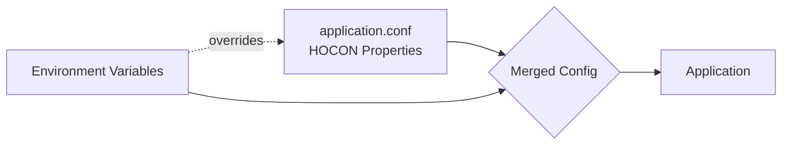

# Configuration

ReadingBat uses a dual-layer configuration system where settings can come from
HOCON config files or environment variables. Environment variables take precedence
when both are defined.

## Configuration Layers



1. **HOCON Properties** (`Property` sealed class) -- Read from `application.conf` via Ktor's config system
2. **Environment Variables** (`EnvVar` enum) -- Override HOCON values when defined

## HOCON Properties

Properties are defined as singleton objects in the `Property` sealed class. They are
initialized from `application.conf` during application startup via `assignProperties()`.

### Reading Properties

```kotlin
--8<-- "ConfigurationExamples.kt:reading_properties"
```

### Property Categories

| Category | Properties | Description |
|----------|-----------|-------------|
| **Content DSL** | `DSL_FILE_NAME`, `DSL_VARIABLE_NAME` | Content loading configuration |
| **Site** | `IS_PRODUCTION`, `IS_TESTING`, `DBMS_ENABLED` | Runtime behavior flags |
| **Database** | `DBMS_URL`, `DBMS_USERNAME`, `DBMS_PASSWORD` | PostgreSQL connection settings |
| **OAuth** | `GITHUB_OAUTH_CLIENT_ID`, `GOOGLE_OAUTH_CLIENT_ID` | OAuth provider credentials |
| **Email** | `RESEND_API_KEY`, `RESEND_SENDER_EMAIL` | Email sending via Resend |
| **Script Pools** | `JAVA_SCRIPTS_POOL_SIZE`, `KOTLIN_SCRIPTS_POOL_SIZE` | JSR-223 engine pool sizes |
| **Monitoring** | `ANALYTICS_ID`, `PROMETHEUS_URL`, `GRAFANA_URL` | Observability configuration |

### HOCON Configuration File

Properties are read from `application.conf` using Ktor's configuration system.
Here's a typical structure:

```hocon
readingbat {
  site {
    production = false
    dbmsEnabled = false
    multiServerEnabled = false
    contentCachingEnabled = false
    googleAnalyticsId = ""
  }

  content {
    fileName = "src/Content.kt"
    variableName = "content"
  }

  scripts {
    javaPoolSize = 5
    kotlinPoolSize = 5
    pythonPoolSize = 5
  }
}

dbms {
  driverClassName = "com.impossibl.postgres.jdbc.PGDriver"
  jdbcUrl = "jdbc:pgsql://localhost:5432/readingbat"
  username = "postgres"
  password = ""
  maxPoolSize = 10
  maxLifetimeMins = 30
}
```

## Environment Variables

Environment variables are defined in the `EnvVar` enum. They override HOCON config
values and are useful for deployment-specific settings.

### Using Environment Variables

```kotlin
--8<-- "ConfigurationExamples.kt:env_var_usage"
```

### Override Pattern

The standard pattern combines both systems -- the environment variable takes
precedence when defined:

```kotlin
--8<-- "ConfigurationExamples.kt:env_overrides_property"
```

### Available Environment Variables

| Variable | Description | Sensitive |
|----------|-------------|-----------|
| `DBMS_URL` | Database JDBC URL | Yes |
| `DBMS_USERNAME` | Database username | No |
| `DBMS_PASSWORD` | Database password | Yes |
| `GITHUB_OAUTH_CLIENT_ID` | GitHub OAuth client ID | No |
| `GITHUB_OAUTH_CLIENT_SECRET` | GitHub OAuth client secret | Yes |
| `GOOGLE_OAUTH_CLIENT_ID` | Google OAuth client ID | No |
| `GOOGLE_OAUTH_CLIENT_SECRET` | Google OAuth client secret | Yes |
| `RESEND_API_KEY` | Resend email API key | Yes |
| `RESEND_SENDER_EMAIL` | Resend sender email address | No |
| `IPGEOLOCATION_KEY` | IP geolocation API key | Yes |
| `AGENT_ENABLED` | Enable Prometheus proxy agent | No |
| `REDIRECT_HOSTNAME` | Hostname for redirects | No |
| `OAUTH_CALLBACK_URL_PREFIX` | OAuth callback URL prefix | No |

!!! tip "Sensitive Value Masking"
    Sensitive environment variables (passwords, API keys, secrets) include a
    `maskFunc` that obfuscates their values in log output. For example,
    `DBMS_PASSWORD` shows only the first character followed by asterisks.

## Secrets

Secrets are loaded from `secrets/secrets.env` (not committed to version control).
The root `build.gradle.kts` `configureSecrets()` function reads this file and
injects values as environment variables into `JavaExec` and `Test` tasks.

Create your secrets file:

```bash
# secrets/secrets.env
DBMS_PASSWORD=my-database-password
GITHUB_OAUTH_CLIENT_SECRET=ghp_xxxxxxxxxxxx
GOOGLE_OAUTH_CLIENT_SECRET=GOCSPX-xxxxxxxxxxxx
RESEND_API_KEY=re_xxxxxxxxxxxx
```

## Property Initialization

Properties are initialized during application startup in `Application.module()`:

1. `assignProperties()` iterates through `Property.initProperties()`
2. Each property's `initFunc` reads the HOCON config and/or environment variable
3. `assignInitialized()` marks the system as ready
4. Reading an uninitialized property with `errorOnNonInit=true` throws an error
