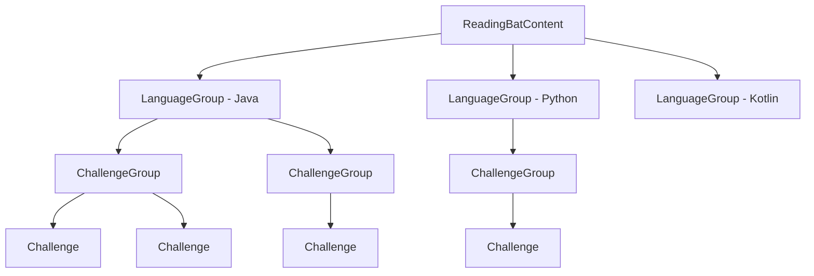

# ReadingBat Core

ReadingBat Core is a Kotlin-based web application framework for creating interactive programming
challenges. It provides a powerful DSL for defining challenges in **Java**, **Python**, and **Kotlin**,
a Ktor-based web server, and real-time feedback via WebSockets.

## Key Features

- **Content DSL** -- Define programming challenges using an expressive Kotlin DSL
- **Multi-language support** -- Java, Python, and Kotlin challenges in a single application
- **Local and remote content** -- Load challenges from the local filesystem or GitHub repositories
- **Real-time feedback** -- WebSocket-powered answer checking and progress tracking
- **Class management** -- Teachers can create classes and monitor student progress
- **Flexible configuration** -- HOCON properties with environment variable overrides

## Quick Start

Define your content using the `readingBatContent` builder:

```kotlin
--8<-- "ContentDslExamples.kt:basic_content"
```

This creates a content definition that:

1. Loads Java source files from the local filesystem
2. Organizes them into a group called "Warmup-1"
3. Auto-discovers all `.java` files in the `warmup1` package

## DSL Hierarchy

The content DSL follows a hierarchical structure:



`ReadingBatContent` :material-arrow-right: `LanguageGroup` :material-arrow-right: `ChallengeGroup` :material-arrow-right: `Challenge`

## Multi-Language Example

ReadingBat supports challenges in all three languages within a single content definition:

```kotlin
--8<-- "ContentDslExamples.kt:multi_language"
```

!!! tip "Java vs. Python/Kotlin"
    Java challenges use `includeFiles` because return types are inferred from source code.
    Python and Kotlin challenges require `includeFilesWithType` with an explicit return type.

## Architecture Overview

| Component | Description |
|-----------|-------------|
| **Content DSL** | Defines challenges via `readingBatContent { }` blocks |
| **Ktor Server** | Serves HTML pages and handles API requests |
| **Script Engines** | JSR-223 engines evaluate Java, Kotlin, and Python code |
| **PostgreSQL** | Stores user accounts, progress, and class data |
| **WebSockets** | Provides real-time answer checking and dashboard updates |
| **Prometheus** | Exports metrics for monitoring |

## API Reference

Full API documentation (KDocs) is available at
[https://readingbat.github.io/readingbat-core/](https://readingbat.github.io/readingbat-core/).

## Next Steps

<div class="grid cards" markdown>

-   :material-language-kotlin: **Content DSL**

    ---

    Learn how to define challenges using the Kotlin DSL

    [:octicons-arrow-right-24: Content DSL](dsl/index.md)

-   :material-cog: **Configuration**

    ---

    Configure the application with HOCON and environment variables

    [:octicons-arrow-right-24: Configuration](configuration/index.md)

-   :material-server: **Server**

    ---

    Understand the Ktor server setup and routing

    [:octicons-arrow-right-24: Server](server/index.md)

-   :material-test-tube: **Testing**

    ---

    Write tests using the Kotest test support utilities

    [:octicons-arrow-right-24: Testing](testing/index.md)

-   :material-book-open-variant: **KDocs**

    ---

    Browse the full API reference documentation

    [:octicons-arrow-right-24: KDocs](https://readingbat.github.io/readingbat-core/)

</div>
